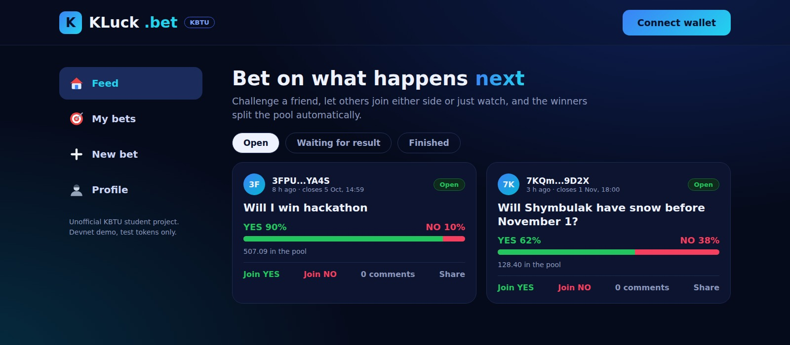

# KLuck.bet — Prediction Market on Solana

[](LICENSE)
[](https://solana.com)
[](https://www.anchor-lang.com/)
[](#known-limitations)

> A Polymarket-inspired prediction market on Solana — create YES/NO markets, trade outcome shares through a constant-product AMM, and redeem winnings 1:1 after resolution. Transactions are signed in the browser; private keys never leave your wallet.

[Live Demo](#) · [Video Walkthrough](#) · [Docs](docs/) · [Submission](#)

> ⚠️ **Experimental.** This project has not been audited and must not be used with real money. Devnet only.

---



---

## Submission

| Name | Role | Contact |
|------|------|---------|
| _Nurgain Alimurat_ | _Founder & Lead Engineer_ | [@Artoriassik](#) |
| _Abdugapbarov Ayub_ | _DevRel & Repository Designer_ | [@Ayub_A_A](#) |
| _Aituganova Albina_ |_Product Designer / Marketing Lead_ | [@byalbinka](#) |
| _Dildakhmet Nurasyl_ | _Research & Product Analyst_ | [@shirukow](#) |

---

## Problem and Solution

### 1. Opaque Pricing
- **Problem:** Prediction markets need a price that reflects the crowd's belief, but order-book markets need many active traders to stay liquid.
- **KLuck.bet:** A constant-product AMM (`y * n = k`, the Gnosis/Omen model) gives an always-available price. YES price = `n / (y + n)`, starting at 0.50.

### 2. Trust in Custody
- **Problem:** Centralized platforms hold user funds and keys.
- **KLuck.bet:** Collateral sits in an on-chain vault per market. Trades are signed in Phantom, so private keys never leave the wallet.

### 3. Unfair Rounding and Overflow Risk
- **Problem:** Naive share math can leak value from the pool or overflow.
- **KLuck.bet:** All math uses `u128`, and rounding always favors the pool.

### 4. Simple, Predictable Payouts
- **Problem:** Users want to know exactly what a winning share is worth.
- **KLuck.bet:** After resolution, each winning share redeems for exactly 1 collateral token; losing shares are worth 0.

---

## Why Solana

- **Speed** — Fast blocks make trading and redeeming feel instant in the browser
- **Cost** — Low transaction fees make small trades and market creation practical
- **Composability** — SPL tokens as collateral and Anchor-based programs fit the ecosystem
- **Tooling** — Phantom wallet support and Solnet make a C# / Blazor WebAssembly frontend possible

---

## Summary of Features

- Create YES/NO markets with initial liquidity
- Buy outcome shares with slippage protection
- Sell shares for an exact amount of collateral
- Resolver declares the winning outcome after the end time
- Winners redeem shares for collateral 1:1
- Creator can collect the leftover winning shares from the pool (`claim_pool`)
- Client-side quote math that matches the contract formula
- Phantom wallet connection with in-browser signing

---

## How It Works

- The pool holds reserves of YES and NO shares (`y` and `n`), and trading keeps `y * n = k` constant.
- Collateral is an SPL token (on devnet, a test token acting as "test USDC").
- After resolution, each winning share redeems for 1 collateral token; losing shares are worth 0.
- Rounding always favors the pool, and all math uses `u128`.

### Contract Instructions

| Instruction | Caller | Description |
|---|---|---|
| `create_market` | anyone | Creates a market and its vault, and deposits the initial liquidity |
| `buy` | anyone | Buys outcome shares with collateral, with slippage protection |
| `sell` | anyone | Sells shares and receives an exact amount of collateral |
| `resolve_market` | resolver (market creator) | Declares the winning outcome after the end time |
| `redeem` | anyone | Winners swap shares for collateral 1:1 |
| `claim_pool` | market creator | Collects the winning shares left in the pool after resolution |

### Accounts

| Account | Contents |
|---|---|
| **Market** | Question, end time, YES/NO reserves, status, winner, vault address |
| **Position** | A user's YES/NO shares in one market (PDA derived from `market + user`) |
| **Vault** | The market's token account holding the collateral |

---

## Tech Stack

| Layer | Technology |
|-------|-----------|
| On-chain program | Rust · Anchor 1.2.0 |
| Frontend | C# · Blazor WebAssembly |
| Solana client | Solnet |
| Wallet | Phantom (JS interop) |
| Collateral | SPL token (test USDC on devnet) |
| Network | Solana devnet |

---

## Architecture

```
┌─────────────────────┐     ┌──────────────────────┐     ┌──────────────────────┐
│  Blazor WASM App    │────▶│   Phantom Wallet     │────▶│   Solana Devnet      │
│  ┌───────────────┐  │     │  (signs in browser)  │     │  ┌────────────────┐  │
│  │ Amm.cs quotes │  │     └──────────────────────┘     │  │ Anchor Program │  │
│  ├───────────────┤  │                                  │  ├────────────────┤  │
│  │ SolanaService │  │◀─────── reads via RPC ───────────│  │ Market / Pos.  │  │
│  └───────────────┘  │                                  │  │ Vault (SPL)    │  │
└─────────────────────┘                                  │  └────────────────┘  │
                                                         └──────────────────────┘
```

### Project Structure

```
polymarket_solana/          # smart contract (Anchor)
├── Anchor.toml
├── programs/polymarket_solana/src/lib.rs
└── target/idl/polymarket_solana.json   # IDL (after anchor build)

PolymarketApp/              # Blazor WebAssembly app
├── wwwroot/wallet.js       # Phantom bridge (JS interop)
├── Services/
│   ├── Chain.cs            # Program ID and mint address
│   ├── WalletService.cs    # wallet connection
│   ├── SolanaService.cs    # reading markets, sending transactions
│   ├── Borsh.cs            # argument serialization
│   ├── MarketInfo.cs       # Market account decoding
│   └── Amm.cs              # quote math (same formula as the contract)
└── Pages/
    ├── Home.razor          # wallet connection and balance
    ├── Markets.razor       # market list and creation
    └── Market.razor        # buy, sell, resolve, redeem
```

> The internal folder, module and namespace names are legacy and can be renamed to `kluckbet`. If you rename the program, run `anchor keys sync` and update `Chain.cs`.

---

## Quick Start

**Prerequisites:**

- Linux / macOS / Windows (WSL)
- [Rust](https://rustup.rs/)
- [Solana CLI (Agave) and Anchor](https://solana.com/docs/intro/installation) — built with Anchor 1.2.0, Solana CLI 3.1.x, platform-tools v1.52
- Node.js and Yarn
- [.NET SDK](https://dotnet.microsoft.com/download) 8 or newer
- [Phantom](https://phantom.app/) browser extension with Testnet Mode (Devnet) enabled

```bash
solana --version
anchor --version
cargo build-sbf --version
dotnet --version
```

### 1. Smart Contract

```bash
cd polymarket_solana

# switch to devnet and get test SOL
solana config set --url devnet
solana address        # paste the address at https://faucet.solana.com

# build and deploy
anchor keys sync
anchor build
anchor deploy --provider.cluster devnet
```

Save the **Program ID** printed by `anchor deploy`. Deploying needs roughly 3 to 5 devnet SOL. If `Anchor.toml` has no `[programs.devnet]` section, copy the line from `[programs.localnet]` into it.

> If LiteSVM tests fail with `InvalidAccountData`, build with the older SBPF target:
> ```bash
> cd programs/polymarket_solana
> cargo build-sbf --arch v0
> cd ../..
> cargo test
> ```

### 2. Test Collateral Token

```bash
cargo install spl-token-cli
spl-token create-token --decimals 6
spl-token create-account <MINT_ADDRESS>
spl-token mint <MINT_ADDRESS> 10000
```

Save the **mint address**. To trade from Phantom, send some tokens to your wallet (which also needs devnet SOL from [faucet.solana.com](https://faucet.solana.com)):

```bash
spl-token transfer <MINT_ADDRESS> 1000 <PHANTOM_ADDRESS> --fund-recipient
```

### 3. Frontend (Blazor)

Set your own values in `PolymarketApp/Services/Chain.cs`:

```csharp
public const string ProgramId = "YOUR_PROGRAM_ID";
public const string CollateralMint = "YOUR_MINT_ADDRESS";
```

Run the app:

```bash
cd PolymarketApp
dotnet restore
dotnet run
```

Open the URL printed in the console in a browser with Phantom installed (network set to Devnet).

> The Market account size (`MarketAccountSize = 376` in `SolanaService.cs`) is 8 + `Market::INIT_SPACE`. If you change the fields of the `Market` struct, update this number.

---

## Usage

1. Open the home page and click **Connect Phantom**.
2. Go to `/markets`, enter a question, the time until the market ends (in minutes) and the initial liquidity, click **Create market**, and approve the transaction in Phantom.
3. After a few seconds, click **Refresh**. The market appears in the list at YES 50% / NO 50%.
4. Open the market, choose an outcome, and buy or sell shares. Quotes are calculated in the client, and the contract makes the final calculation.
5. After the end time, the resolver (the wallet that created the market) picks the winner with **YES won** or **NO won**.
6. Winners click **Redeem winnings** to get their tokens back.

💡 To test the full cycle quickly, create a market that ends in 5 to 10 minutes.

---

## Known Limitations

- Devnet only, and the contract has not been audited.
- No trading fee.
- A single trusted resolver (the market creator), with no oracle or dispute process.
- `claim_pool` exists in the contract but is not in the UI yet.
- No automated contract tests; a manual run through the UI serves as the test.
- No backend or indexer: the app reads data directly from Solana RPC, so there is no price history.

---

## Roadmap

- [x] Constant-product AMM market contract
- [x] Buy, sell, resolve and redeem flow
- [x] Phantom wallet integration
- [ ] `claim_pool` button in the UI
- [ ] Trading fee
- [ ] Safer resolution (oracle / multisig / disputes)
- [ ] Automated contract tests
- [ ] ASP.NET Core backend with an indexer and PostgreSQL (price history, portfolio)
- [ ] Price charts and a portfolio page
- [ ] Security audit before any use with real money

Full roadmap: [docs/roadmap.md](docs/roadmap.md)

---

## Resources

- [Project Presentation](https://htmlpreview.github.com/AlimuratNur/KLuck.bet/blob/Main/assets/presentation.html)
- [Video Demo](#)
- [Live Application](https://kluck-bet.vercel.app)
- [Solana docs](https://solana.com/docs)
- [Anchor](https://www.anchor-lang.com/)
- [Solnet](https://github.com/bmresearch/Solnet)
- [Solana Explorer (devnet)](https://explorer.solana.com/?cluster=devnet)

---

## License

MIT — see [LICENSE](LICENSE)
